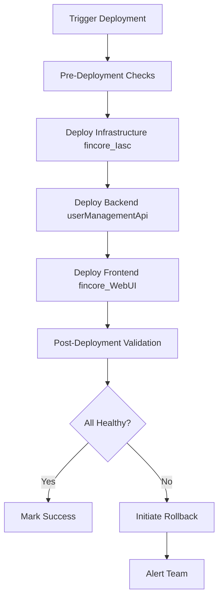

# 🤖 Agentic AI-Powered SDLC Automation Plan

## 📋 Executive Summary

This document outlines a comprehensive plan to implement full agentic AI-powered Software Development Lifecycle (SDLC) automation across three repositories:
- **Backend**: userManagementApi
- **Frontend**: fincore_WebUI  
- **Infrastructure**: fincore_Iasc

### Goals
- Automate end-to-end SDLC from story intake to production deployment
- Enable AI agents to handle architecture, development, testing, and documentation
- Maintain high code quality and security standards
- Reduce manual intervention while keeping human oversight for critical decisions

---

## 🏗️ Architecture Overview

### High-Level Flow
```
Story/Issue Creation 
  ↓
AI Story Analyzer & Architect
  ↓
Architecture Design & Review
  ↓
AI Developer Agent (Multi-Repo)
  ↓
Automated Testing (Unit/Integration/E2E)
  ↓
AI Code Review & Quality Gates
  ↓
Documentation Generation
  ↓
Human Approval Gate (Optional)
  ↓
Staging Deployment
  ↓
AI-Powered Smoke Testing
  ↓
Human Approval for Production
  ↓
Production Deployment
  ↓
Post-Deployment Monitoring
```

---

## 🎯 Phase 1: Foundation & Infrastructure Setup

### 1.1 GitHub Repository Configuration

#### Shared Infrastructure (All 3 Repos)

**GitHub Issues Templates**
- [ ] Create `.github/ISSUE_TEMPLATE/story.yml` - User story template
- [ ] Create `.github/ISSUE_TEMPLATE/bug.yml` - Bug report template  
- [ ] Create `.github/ISSUE_TEMPLATE/tech-debt.yml` - Technical debt template
- [ ] Create `.github/ISSUE_TEMPLATE/architecture.yml` - Architecture decision template

**GitHub Labels**
```yaml
Labels to create:
- ai:story-analysis (blue) - AI analyzing story
- ai:architecture (purple) - AI designing architecture
- ai:development (green) - AI developing code
- ai:testing (yellow) - AI running tests
- ai:documentation (orange) - AI updating docs
- ai:review-needed (red) - Human review required
- ai:approved (green) - AI approved changes
- environment:npe (gray)
- environment:production (red)
- complexity:low (green)
- complexity:medium (yellow)
- complexity:high (red)
- type:story (blue)
- type:bug (red)
- type:tech-debt (orange)
```

#### Branch Protection Rules
```yaml
main:
  required_reviews: 1
  require_status_checks:
    - ai-code-review
    - unit-tests
    - integration-tests
    - e2e-tests
    - security-scan
    - documentation-check
  enforce_admins: false
  allow_force_pushes: false

npe:
  required_reviews: 0
  require_status_checks:
    - unit-tests
    - integration-tests
  auto_deploy: true
```

### 1.2 AI Agent Infrastructure

#### GitHub Copilot Workspace Configuration
- [ ] Set up `.github/copilot-instructions.md` per repository
- [ ] Configure agent modes for different tasks
- [ ] Define skill files for domain-specific knowledge

#### Custom GitHub Actions (Reusable Workflows)

**`.github/workflows/ai-story-analyzer.yml`**
```yaml
Purpose: Analyze new issues and extract requirements
Triggers: issues.opened, issues.edited
Actions:
  - Parse story description
  - Extract acceptance criteria
  - Identify affected repositories
  - Generate technical requirements
  - Create architecture tasks
  - Add appropriate labels
```

**`.github/workflows/ai-architect.yml`**
```yaml
Purpose: Design system architecture
Triggers: label:ai:architecture
Actions:
  - Analyze requirements
  - Review existing codebase
  - Generate architecture diagrams (Mermaid)
  - Identify impacted components
  - Create implementation plan
  - Generate ADR (Architecture Decision Record)
```

**`.github/workflows/ai-developer.yml`**
```yaml
Purpose: Implement code changes
Triggers: label:ai:development
Actions:
  - Create feature branch
  - Implement changes across repos
  - Write unit tests
  - Run local validation
  - Create pull request with detailed description
```

**`.github/workflows/ai-test-orchestrator.yml`**
```yaml
Purpose: Coordinate all testing phases
Triggers: pull_request.opened, pull_request.synchronize
Stages:
  - Unit tests (parallel)
  - Integration tests (sequential)
  - E2E tests (sequential)
  - Performance tests (optional)
  - Security scans (parallel)
  - Accessibility tests (parallel)
```

**`.github/workflows/ai-code-reviewer.yml`**
```yaml
Purpose: AI-powered code review
Triggers: pull_request.opened, pull_request.synchronize
Actions:
  - Analyze code changes
  - Check coding standards
  - Identify potential bugs
  - Review test coverage
  - Suggest improvements
  - Auto-approve or request changes
```

**`.github/workflows/ai-documentation.yml`**
```yaml
Purpose: Update documentation automatically
Triggers: pull_request.merged
Actions:
  - Update API documentation
  - Generate changelog entries
  - Update README files
  - Create/update architecture diagrams
  - Update deployment documentation
```

---

## 🎯 Phase 2: AI Agent Implementation

### 2.1 Story Analyzer Agent

**Technology**: GitHub Copilot + Custom GitHub Action

**Responsibilities**:
1. Parse incoming issues/stories
2. Extract structured information:
   - Feature description
   - Acceptance criteria
   - Technical requirements
   - Affected repositories
   - Estimated complexity
3. Auto-label and categorize
4. Create linked issues across repositories if needed

**Implementation**:
```typescript
// .github/actions/story-analyzer/index.ts
interface Story {
  title: string;
  description: string;
  acceptanceCriteria: string[];
  affectedRepos: Repository[];
  complexity: 'low' | 'medium' | 'high';
  technicalRequirements: TechnicalRequirement[];
}

class StoryAnalyzerAgent {
  async analyze(issue: GitHubIssue): Promise<Story> {
    // Use GitHub Copilot API to analyze story
    // Parse and structure information
    // Return structured story
  }
  
  async createArchitectureTask(story: Story): Promise<void> {
    // Create architecture issue if needed
    // Link to original story
  }
}
```

**Output**:
- Structured story object stored in issue comments
- Auto-created architecture tasks
- Cross-repository links
- Labels applied

### 2.2 Architecture Agent

**Technology**: GitHub Copilot + Mermaid Diagrams

**Responsibilities**:
1. Analyze requirements and existing architecture
2. Design solution architecture
3. Generate architecture diagrams
4. Create Architecture Decision Records (ADRs)
5. Identify component interactions
6. Plan database schema changes
7. Design API contracts

**Implementation**:
```typescript
// .github/actions/architect/index.ts
interface Architecture {
  diagrams: MermaidDiagram[];
  adr: ADR;
  implementationPlan: ImplementationStep[];
  apiContracts: APIContract[];
  databaseChanges: DatabaseMigration[];
  securityConsiderations: SecurityNote[];
}

class ArchitectAgent {
  async design(story: Story): Promise<Architecture> {
    // Analyze existing codebase
    // Design solution
    // Generate diagrams and documentation
  }
  
  async createImplementationIssues(arch: Architecture): Promise<void> {
    // Break down into implementation tasks
    // Create issues per repository
  }
}
```

**Output**:
- Architecture diagrams (Mermaid format)
- ADR document in `.adr/` directory
- Implementation tasks per repository
- API contract specifications (OpenAPI)

### 2.3 Developer Agent

**Technology**: GitHub Copilot Workspace + Multi-file Editing

**Responsibilities**:
1. Implement features based on architecture
2. Write comprehensive unit tests
3. Update integration tests
4. Maintain coding standards
5. Handle cross-repository changes
6. Create meaningful commit messages

**Implementation Approach**:
- Use GitHub Copilot Workspace for multi-file editing
- Custom skills for backend/frontend/infrastructure patterns
- Agent instructions per repository type

**Repository-Specific Skills**:

**Backend (userManagementApi)**:
```markdown
# .github/copilot-instructions.md
Framework: Node.js/Express or similar
Patterns:
- Repository pattern for data access
- Service layer for business logic
- Controller layer for HTTP handling
- Dependency injection
Testing:
- Jest for unit tests
- Supertest for integration tests
- 80%+ code coverage required
Security:
- Input validation
- SQL injection prevention
- Authentication/authorization
```

**Frontend (fincore_WebUI)**:
```markdown
# .github/copilot-instructions.md
Framework: React + TypeScript + Material-UI
Patterns:
- Component composition
- Custom hooks for logic
- Context for state management
- Service layer for API calls
Testing:
- React Testing Library for unit tests
- Playwright for E2E tests
- Accessibility testing required
Standards:
- TypeScript strict mode
- ESLint + Prettier
- Responsive design
```

**Infrastructure (fincore_Iasc)**:
```markdown
# .github/copilot-instructions.md
Framework: Terraform or similar IaC
Patterns:
- Modular structure
- Environment-specific configurations
- State management
- Secrets management
Testing:
- Terraform validate
- tflint for linting
- terratest for testing
Security:
- Least privilege access
- Encrypted secrets
- Network security
```

### 2.4 Test Orchestrator Agent

**Technology**: GitHub Actions + Playwright + Jest

**Responsibilities**:
1. Run all test suites in correct order
2. Parallelize independent tests
3. Collect and analyze results
4. Generate test reports
5. Update test coverage metrics
6. Flag insufficient coverage

**Test Pipeline**:
```yaml
Test Stages:
  1. Static Analysis (parallel):
     - ESLint/TSLint
     - Type checking
     - Prettier formatting
     - Security scanning (Snyk/Dependabot)
  
  2. Unit Tests (parallel per repo):
     - Backend: Jest + Supertest
     - Frontend: Jest + React Testing Library
     - Infrastructure: Terraform validate
  
  3. Integration Tests (sequential):
     - API integration tests
     - Database integration tests
     - Service-to-service tests
  
  4. E2E Tests (sequential):
     - UI workflows (Playwright)
     - Critical user journeys
     - Cross-browser testing
  
  5. Performance Tests (optional):
     - Load testing
     - Response time validation
  
  6. Accessibility Tests:
     - WCAG 2.1 compliance
     - Screen reader compatibility
```

### 2.5 Code Review Agent

**Technology**: GitHub Copilot + Custom Review Rules

**Responsibilities**:
1. Analyze code changes
2. Check against coding standards
3. Identify bugs and code smells
4. Review test coverage
5. Security vulnerability detection
6. Performance implications
7. Suggest improvements
8. Auto-approve or request changes

**Review Criteria**:
```yaml
Auto-Approve If:
  - All tests passing
  - Coverage >= 80%
  - No security vulnerabilities
  - Follows coding standards
  - No breaking changes
  - Performance acceptable
  - Documentation updated

Request Changes If:
  - Tests failing
  - Coverage < 80%
  - Security issues found
  - Coding standard violations
  - Breaking changes without migration plan
  - Missing documentation

Human Review Required If:
  - Database schema changes
  - API breaking changes
  - Security-critical changes
  - Architecture modifications
  - Production configuration changes
```

**Implementation**:
```typescript
// .github/actions/code-reviewer/index.ts
interface ReviewResult {
  approved: boolean;
  comments: ReviewComment[];
  suggestions: CodeSuggestion[];
  requiresHuman: boolean;
  severity: 'info' | 'warning' | 'error';
}

class CodeReviewAgent {
  async review(pr: PullRequest): Promise<ReviewResult> {
    // Analyze code changes
    // Check all criteria
    // Generate review comments
    // Determine approval status
  }
  
  async requestHumanReview(pr: PullRequest, reason: string): Promise<void> {
    // Add label for human review
    // Notify reviewers
    // Provide context
  }
}
```

### 2.6 Documentation Agent

**Technology**: GitHub Copilot + Markdown Generation

**Responsibilities**:
1. Update API documentation (OpenAPI/Swagger)
2. Generate changelog entries
3. Update README files
4. Create/update architecture diagrams
5. Update deployment guides
6. Generate release notes
7. Update user guides

**Documentation Types**:

**API Documentation**:
- Auto-generate from code annotations
- Keep OpenAPI/Swagger spec updated
- Generate API reference docs

**Code Documentation**:
- JSDoc/TSDoc comments
- Inline code explanations
- Component documentation

**User Documentation**:
- Feature guides
- Troubleshooting guides
- FAQ updates

**Technical Documentation**:
- Architecture diagrams
- Deployment procedures
- Database schemas
- Infrastructure diagrams

**Implementation**:
```typescript
// .github/actions/documentation/index.ts
class DocumentationAgent {
  async updateAPIDocs(changes: CodeChange[]): Promise<void> {
    // Extract API changes
    // Update OpenAPI spec
    // Generate API reference
  }
  
  async generateChangelog(pr: PullRequest): Promise<void> {
    // Extract changes
    // Categorize (Added/Changed/Fixed/Removed)
    // Update CHANGELOG.md
  }
  
  async updateArchitectureDiagrams(changes: ArchitectureChange[]): Promise<void> {
    // Update or create Mermaid diagrams
    // Keep diagrams in sync with code
  }
}
```

---

## 🎯 Phase 3: Deployment Automation

### 3.1 Multi-Environment Strategy

**Environments**:
```yaml
Development (dev):
  - Auto-deploy on feature branch updates
  - Isolated resources
  - Quick feedback
  
Non-Production (npe):
  - Auto-deploy on merge to main
  - Integration environment
  - Full test suite execution
  
Staging (staging):
  - Manual promotion from npe
  - Production-like environment
  - Final validation
  
Production (prod):
  - Manual approval required
  - Gradual rollout
  - Rollback capability
```

### 3.2 Deployment Workflow

**`.github/workflows/deploy-orchestrator.yml`**
```yaml
name: Deployment Orchestrator

on:
  workflow_dispatch:
    inputs:
      environment:
        type: choice
        options: [npe, staging, production]
      version:
        type: string
        required: true

jobs:
  pre-deployment-checks:
    runs-on: ubuntu-latest
    steps:
      - Validate all tests passed
      - Check security scans
      - Verify documentation updated
      - Validate infrastructure state
  
  deploy-infrastructure:
    needs: pre-deployment-checks
    uses: ./.github/workflows/deploy-infrastructure.yml
    with:
      environment: ${{ inputs.environment }}
  
  deploy-backend:
    needs: deploy-infrastructure
    uses: ./.github/workflows/deploy-backend.yml
    with:
      environment: ${{ inputs.environment }}
  
  deploy-frontend:
    needs: deploy-backend
    uses: ./.github/workflows/deploy-frontend.yml
    with:
      environment: ${{ inputs.environment }}
  
  post-deployment-validation:
    needs: [deploy-frontend]
    runs-on: ubuntu-latest
    steps:
      - Run smoke tests
      - Verify health endpoints
      - Check monitoring alerts
      - Update deployment status
  
  rollback-on-failure:
    if: failure()
    runs-on: ubuntu-latest
    steps:
      - Rollback frontend
      - Rollback backend
      - Rollback infrastructure (if safe)
      - Notify team
```

### 3.3 Deployment Order & Dependencies



---

## 🎯 Phase 4: Monitoring & Feedback Loop

### 4.1 AI-Powered Monitoring Agent

**Responsibilities**:
1. Monitor application health
2. Analyze error patterns
3. Detect anomalies
4. Auto-create bug reports
5. Suggest fixes
6. Track SLA/SLO metrics

**Implementation**:
```yaml
Monitoring Sources:
  - Application logs (GCP Cloud Logging)
  - Error tracking (Sentry/similar)
  - Performance metrics (Cloud Monitoring)
  - Infrastructure metrics
  - User analytics

Alert Thresholds:
  - Error rate > 1%
  - Response time > 2s (p95)
  - CPU usage > 80%
  - Memory usage > 85%
  - Disk usage > 90%

Auto-Actions:
  - Create GitHub issue for errors
  - Scale infrastructure if needed
  - Notify on-call team
  - Trigger rollback if critical
```

### 4.2 Continuous Learning

**Feedback Mechanisms**:
1. Track AI agent performance
   - Success rate of auto-merged PRs
   - Test failure rates
   - Bug escape rate
   - Documentation accuracy

2. Learn from human interventions
   - Track when humans override AI
   - Analyze rejection reasons
   - Update agent instructions

3. Improve over time
   - Update prompts based on outcomes
   - Refine code review criteria
   - Enhance test coverage rules

---

## 🎯 Phase 5: Security & Compliance

### 5.1 Security Automation

**Security Scans**:
- [ ] Dependabot for dependency updates
- [ ] Snyk for vulnerability scanning
- [ ] SAST (Static Application Security Testing)
- [ ] DAST (Dynamic Application Security Testing)
- [ ] Container scanning
- [ ] Infrastructure security scanning

**Secrets Management**:
- [ ] GitHub Secrets for sensitive data
- [ ] GCP Secret Manager integration
- [ ] Automatic rotation policies
- [ ] No secrets in code validation

### 5.2 Compliance & Audit Trail

**Audit Requirements**:
```yaml
Track:
  - All code changes (Git history)
  - AI decisions and reasoning
  - Human approvals
  - Deployment history
  - Rollback events
  - Security incidents

Reports:
  - Weekly deployment summary
  - Monthly security report
  - Quarterly compliance audit
  - AI performance metrics
```

---

## 🎯 Phase 6: Human-in-the-Loop

### 6.1 When Human Review is Required

**Mandatory Human Review**:
1. Production deployments
2. Database schema changes
3. API breaking changes
4. Security-critical changes
5. Architecture decisions
6. Cost-impacting changes
7. Compliance-related changes

**Optional Human Review**:
1. Medium/High complexity changes
2. New AI-generated patterns
3. Cross-repository changes
4. Configuration changes

### 6.2 Human Oversight Dashboard

**Dashboard Features**:
- Real-time AI agent activity
- Pending approvals
- Recent deployments
- Test results
- Security alerts
- AI performance metrics

**Implementation**: GitHub Projects with automation

---

## 📊 Success Metrics

### Key Performance Indicators (KPIs)

**Development Velocity**:
- Time from story to production
- Number of deployments per week
- Lead time for changes

**Quality Metrics**:
- Test coverage percentage
- Bug escape rate
- Mean time to detection (MTTD)
- Mean time to resolution (MTTR)

**AI Performance**:
- PR auto-approval rate
- AI-generated code quality score
- Human intervention rate
- Documentation accuracy

**Business Metrics**:
- Feature delivery rate
- Developer productivity
- Deployment frequency
- Change failure rate

---

## 🗓️ Implementation Timeline

### Phase 1: Foundation (Weeks 1-2)
- [ ] Set up GitHub templates and labels
- [ ] Configure branch protection
- [ ] Create reusable workflow templates
- [ ] Set up monitoring infrastructure

### Phase 2: Core AI Agents (Weeks 3-6)
- [ ] Implement Story Analyzer Agent
- [ ] Implement Architecture Agent
- [ ] Implement Developer Agent (basic)
- [ ] Implement Test Orchestrator
- [ ] Test with small stories

### Phase 3: Advanced Features (Weeks 7-10)
- [ ] Implement Code Review Agent
- [ ] Implement Documentation Agent
- [ ] Enhance Developer Agent (multi-repo)
- [ ] Implement Monitoring Agent
- [ ] Full integration testing

### Phase 4: Production Rollout (Weeks 11-12)
- [ ] Deploy to NPE environment
- [ ] Monitor and tune agents
- [ ] Gather feedback
- [ ] Iterate on improvements

### Phase 5: Optimization (Ongoing)
- [ ] Continuous learning implementation
- [ ] Performance optimization
- [ ] Agent enhancement
- [ ] Feature additions

---

## 🛠️ Technology Stack

### Core Technologies
```yaml
AI/ML:
  - GitHub Copilot (code generation)
  - GitHub Copilot Workspace (multi-file editing)
  - OpenAI API (optional for advanced analysis)

CI/CD:
  - GitHub Actions (orchestration)
  - GitHub Environments (deployment stages)
  - Artifact Registry (Docker images)

Testing:
  - Jest (unit tests)
  - Playwright (E2E tests)
  - React Testing Library (component tests)
  - Supertest (API tests)

Infrastructure:
  - GCP Cloud Run (containerized apps)
  - GCP Artifact Registry (Docker registry)
  - GCP Secret Manager (secrets)
  - Terraform (IaC)

Monitoring:
  - GCP Cloud Monitoring
  - GCP Cloud Logging
  - Sentry (error tracking)
  - GitHub Insights (metrics)

Documentation:
  - Markdown (general docs)
  - OpenAPI/Swagger (API docs)
  - Mermaid (diagrams)
  - GitHub Wiki (knowledge base)
```

---

## 💰 Cost Estimation

### GitHub Copilot Costs
- GitHub Copilot Business: $39/user/month (for enhanced features)
- Estimated: 3-5 developers = $195-$390/month

### GitHub Actions Minutes
- Current usage: ~500 minutes/month
- Expected with AI: ~2,000 minutes/month
- Cost: ~$0 (within free tier for private repos or $8/month)

### GCP Costs (Per Environment)
- Cloud Run: ~$20-50/month per service
- Artifact Registry: ~$10/month
- Monitoring: ~$5/month
- Total per environment: ~$100-200/month

### Total Estimated Costs
- GitHub: $200-400/month
- GCP (3 environments): $300-600/month
- **Total: ~$500-1,000/month**

### ROI Calculation
```
Time Saved:
  - Manual development: 40 hours/week → 20 hours/week
  - Manual testing: 10 hours/week → 2 hours/week
  - Manual documentation: 5 hours/week → 1 hour/week
  - Total saved: 32 hours/week = 128 hours/month

Developer Cost Savings:
  - 128 hours × $75/hour = $9,600/month saved
  
ROI: ($9,600 - $1,000) / $1,000 = 860% monthly ROI
Payback Period: < 1 week
```

---

## 🚀 Quick Start Implementation

### Immediate Actions (Day 1)

1. **Repository Setup**:
```bash
# For each repo (userManagementApi, fincore_WebUI, fincore_Iasc)
git clone https://github.com/kasisheraz/<repo-name>
cd <repo-name>

# Create directory structure
mkdir -p .github/workflows
mkdir -p .github/ISSUE_TEMPLATE
mkdir -p .github/actions
mkdir -p docs/adr
mkdir -p docs/architecture
```

2. **Install GitHub App (if needed)**:
   - Enable GitHub Copilot for organization
   - Enable Dependabot
   - Configure branch protection

3. **Create First Workflow**:
   - Start with `ai-story-analyzer.yml`
   - Test with a sample issue
   - Iterate and improve

### Week 1 Goals
- [ ] Complete repository structure setup
- [ ] Configure GitHub settings
- [ ] Create issue templates
- [ ] Set up labels
- [ ] Deploy first AI workflow (Story Analyzer)
- [ ] Test with 2-3 sample stories

---

## 📚 Documentation Structure

### Per Repository
```
docs/
├── README.md (overview)
├── AGENTIC_AI_SDLC_PLAN.md (this document)
├── CONTRIBUTING.md (how to contribute)
├── adr/ (Architecture Decision Records)
│   ├── 0001-use-agentic-ai.md
│   ├── 0002-github-actions-orchestration.md
│   └── template.md
├── architecture/
│   ├── system-overview.md
│   ├── diagrams/
│   └── api-contracts/
├── runbooks/
│   ├── deployment.md
│   ├── rollback.md
│   └── troubleshooting.md
└── agents/
    ├── story-analyzer.md
    ├── architect.md
    └── developer.md
```

---

## ⚠️ Risks & Mitigation

### Risk Matrix

| Risk | Probability | Impact | Mitigation |
|------|-------------|--------|------------|
| AI generates buggy code | Medium | High | Mandatory test coverage, code review |
| Deployment failures | Low | High | Automated rollback, staging validation |
| Security vulnerabilities | Medium | High | Multiple security scans, human review |
| Cost overruns | Low | Medium | Budget alerts, usage monitoring |
| AI hallucinates requirements | Medium | Medium | Human review for critical changes |
| Test coverage gaps | Medium | High | Coverage thresholds, manual spot checks |
| Documentation drift | Low | Low | Automated doc generation |

### Mitigation Strategies

1. **Gradual Rollout**:
   - Start with low-risk, non-critical features
   - Increase autonomy as confidence grows
   - Always keep human in the loop for critical changes

2. **Quality Gates**:
   - Multiple layers of automated checks
   - Mandatory test coverage thresholds
   - Security scans before deployment

3. **Monitoring & Alerts**:
   - Real-time monitoring of all deployments
   - Automated alerting for anomalies
   - Quick rollback capabilities

4. **Regular Audits**:
   - Weekly review of AI decisions
   - Monthly security audits
   - Quarterly process improvements

---

## 📞 Next Steps

### To Begin Implementation:

1. **Review this plan** with your team
2. **Prioritize features** based on your needs
3. **Set up a pilot** in one repository first (suggest: fincore_WebUI)
4. **Start with Phase 1** (Foundation)
5. **Iterate quickly** and gather feedback

### Questions to Decide:

1. Which repository to pilot with?
2. What's the first story to automate end-to-end?
3. Who will be the human reviewers for critical changes?
4. What's your acceptable risk level for AI autonomy?
5. Budget approval for GitHub Copilot Business?

### Contact & Collaboration:

- **GitHub Organization**: kasisheraz
- **Repositories**: 
  - userManagementApi
  - fincore_WebUI
  - fincore_Iasc

---

## 📖 References & Resources

### GitHub Documentation
- [GitHub Actions Documentation](https://docs.github.com/en/actions)
- [GitHub Copilot Documentation](https://docs.github.com/en/copilot)
- [Workflow Syntax](https://docs.github.com/en/actions/reference/workflow-syntax-for-github-actions)

### Best Practices
- [The Twelve-Factor App](https://12factor.net/)
- [Semantic Versioning](https://semver.org/)
- [Conventional Commits](https://www.conventionalcommits.org/)
- [Keep a Changelog](https://keepachangelog.com/)

### Testing
- [Playwright Documentation](https://playwright.dev/)
- [Jest Documentation](https://jestjs.io/)
- [Testing Trophy](https://kentcdodds.com/blog/the-testing-trophy-and-testing-classifications)

### Architecture
- [Architecture Decision Records](https://adr.github.io/)
- [C4 Model](https://c4model.com/)
- [Mermaid Diagrams](https://mermaid.js.org/)

---

## 🎯 Conclusion

This comprehensive plan provides a roadmap for implementing full agentic AI-powered SDLC automation across your three repositories. The approach is:

✅ **Incremental**: Start small, expand gradually
✅ **Safe**: Multiple quality gates and human oversight
✅ **Scalable**: Can grow with your needs
✅ **Cost-effective**: High ROI with manageable costs
✅ **Maintainable**: Clear documentation and processes

**The goal is not to replace developers, but to amplify their capabilities** - letting AI handle repetitive tasks while humans focus on creative problem-solving and strategic decisions.

---

**Ready to start?** Let's begin with Phase 1! 🚀
