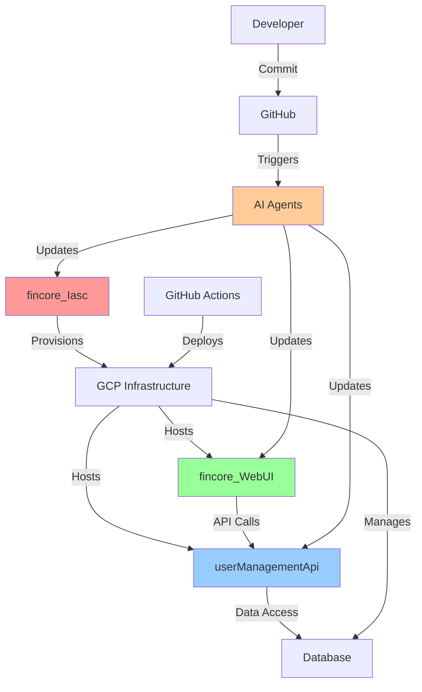

# 🔄 Multi-Repository Coordination Guide

This guide explains how the three repositories work together in the agentic AI SDLC automation.

---

## 📦 Repository Overview

### 1. **fincore_WebUI** (Frontend)
- **Tech Stack**: React, TypeScript, Material-UI
- **Purpose**: User interface and experience
- **Current State**: ✅ Has CI/CD, E2E testing with Playwright
- **Deployment**: GCP Cloud Run
- **NPE URL**: https://fincore-webui-npe-[hash].run.app

### 2. **userManagementApi** (Backend)
- **Tech Stack**: Node.js/Express (assumed)
- **Purpose**: Business logic, data access, API endpoints
- **Needs**: Unit tests, integration tests, API documentation
- **Deployment**: GCP Cloud Run (assumed)
- **API URL**: Backend service endpoint

### 3. **fincore_Iasc** (Infrastructure as Code)
- **Tech Stack**: Terraform (assumed)
- **Purpose**: Infrastructure provisioning and configuration
- **Manages**: Cloud resources, networking, databases, secrets
- **Deployment**: Terraform apply via GitHub Actions

---

## 🔗 How Repositories Interact



---

## 🎯 Change Scenarios & Coordination

### Scenario 1: New API Endpoint

**Story**: "As a user, I want to view my profile details"

**Affected Repos**: Backend + Frontend

**Workflow**:
1. AI Story Analyzer detects multi-repo change
2. Creates linked issues in both repos:
   - `userManagementApi#123`: Implement GET /api/users/profile
   - `fincore_WebUI#456`: Add profile page UI
3. AI Architecture Agent designs:
   - API contract (OpenAPI spec)
   - Response format
   - Error handling
4. AI Developer Agent creates PRs:
   - Backend PR: New endpoint with tests
   - Frontend PR: New page consuming endpoint
5. PRs are linked via comments
6. Testing: Backend → Frontend (sequential)
7. Deployment: Backend first, then Frontend

**Issue Linking**:
```markdown
<!-- In backend issue -->
Related to fincore_WebUI#456

<!-- In frontend issue -->
Depends on userManagementApi#123
```

### Scenario 2: Database Schema Change

**Story**: "Add two-factor authentication"

**Affected Repos**: Infrastructure + Backend + Frontend

**Workflow**:
1. AI detects high complexity (database change)
2. Requires human architecture review
3. Creates issues in all three repos:
   - `fincore_Iasc#10`: Add 2FA secrets table
   - `userManagementApi#124`: Implement 2FA logic
   - `fincore_WebUI#457`: Add 2FA UI
4. Sequential execution:
   - Infrastructure → creates tables
   - Backend → implementation
   - Frontend → UI
5. Migration plan created
6. Rollback procedure documented

**Coordination Pattern**:
```yaml
Phase 1 (Infrastructure):
  - Create database schema
  - Add necessary secrets
  - Deploy to NPE
  - Validate with schema checks

Phase 2 (Backend):
  - Wait for infrastructure
  - Implement 2FA service
  - Add API endpoints
  - Deploy to NPE
  - Validate with integration tests

Phase 3 (Frontend):
  - Wait for backend
  - Implement 2FA UI
  - Add QR code generation
  - Deploy to NPE
  - E2E testing
```

### Scenario 3: Configuration Change

**Story**: "Increase rate limiting from 100 to 200 requests/min"

**Affected Repos**: Backend only (simple change)

**Workflow**:
1. AI detects low complexity
2. Single repo change
3. Auto-development enabled
4. Quick review and deploy

### Scenario 4: New Service Addition

**Story**: "Add email notification service"

**Affected Repos**: All three

**Workflow**:
1. Infrastructure: Add SendGrid/SMTP service, configure secrets
2. Backend: Implement email service, add endpoints
3. Frontend: Add notification preferences UI
4. Complex coordination with phased rollout

---

## 🚀 Deployment Order Matrix

| Change Type | Infra | Backend | Frontend | Order |
|-------------|-------|---------|----------|-------|
| UI Only | ❌ | ❌ | ✅ | Frontend |
| Backend Logic | ❌ | ✅ | ❌ | Backend |
| New Endpoint | ❌ | ✅ | ✅ | Backend → Frontend |
| DB Schema | ✅ | ✅ | ✅ | Infra → Backend → Frontend |
| Config Change | ✅ | ✅ | ❌ | Infra → Backend |
| New Service | ✅ | ✅ | ✅ | Infra → Backend → Frontend |
| Security Update | ✅ | ✅ | ✅ | All in parallel (with testing) |

---

## 🔧 Cross-Repository Workflows

### Workflow 1: Synchronized Deployment

**`.github/workflows/deploy-all.yml`** (in a central repo or each repo)

```yaml
name: Synchronized Multi-Repo Deployment

on:
  workflow_dispatch:
    inputs:
      environment:
        type: choice
        options: [npe, staging, production]
      issue_number:
        description: 'Related issue number'
        required: true

jobs:
  check-dependencies:
    runs-on: ubuntu-latest
    outputs:
      needs_infra: ${{ steps.check.outputs.needs_infra }}
      needs_backend: ${{ steps.check.outputs.needs_backend }}
      needs_frontend: ${{ steps.check.outputs.needs_frontend }}
    steps:
      - name: Check which repos are affected
        id: check
        uses: actions/github-script@v7
        with:
          script: |
            // Logic to determine which repos need deployment
            // Based on issue labels or PR comments
            
  deploy-infrastructure:
    if: needs.check-dependencies.outputs.needs_infra == 'true'
    needs: check-dependencies
    uses: kasisheraz/fincore_Iasc/.github/workflows/deploy.yml@main
    with:
      environment: ${{ inputs.environment }}
    secrets: inherit

  deploy-backend:
    if: needs.check-dependencies.outputs.needs_backend == 'true'
    needs: [check-dependencies, deploy-infrastructure]
    uses: kasisheraz/userManagementApi/.github/workflows/deploy.yml@main
    with:
      environment: ${{ inputs.environment }}
    secrets: inherit

  deploy-frontend:
    if: needs.check-dependencies.outputs.needs_frontend == 'true'
    needs: [check-dependencies, deploy-backend]
    uses: kasisheraz/fincore_WebUI/.github/workflows/deploy-gcp.yml@main
    with:
      environment: ${{ inputs.environment }}
    secrets: inherit

  post-deployment-test:
    needs: [deploy-infrastructure, deploy-backend, deploy-frontend]
    if: always()
    runs-on: ubuntu-latest
    steps:
      - name: Run E2E smoke tests
        run: |
          # Test critical user journeys
          # Verify all services healthy
          # Check API contracts
```

### Workflow 2: Multi-Repo PR Creation

**AI Developer Agent** will create linked PRs:

```typescript
// .github/actions/multi-repo-pr/index.ts
class MultiRepoPRCreator {
  async createLinkedPRs(story: Story, code: CodeChanges) {
    const prs = [];
    
    // Create infrastructure PR if needed
    if (code.infrastructure) {
      const infraPR = await this.createPR('fincore_Iasc', {
        branch: `feature/${story.id}-infra`,
        title: `[INFRA] ${story.title}`,
        body: this.generatePRBody(story, 'infrastructure'),
        changes: code.infrastructure
      });
      prs.push(infraPR);
    }
    
    // Create backend PR
    if (code.backend) {
      const backendPR = await this.createPR('userManagementApi', {
        branch: `feature/${story.id}-api`,
        title: `[API] ${story.title}`,
        body: this.generatePRBody(story, 'backend', prs),
        changes: code.backend
      });
      prs.push(backendPR);
    }
    
    // Create frontend PR
    if (code.frontend) {
      const frontendPR = await this.createPR('fincore_WebUI', {
        branch: `feature/${story.id}-ui`,
        title: `[UI] ${story.title}`,
        body: this.generatePRBody(story, 'frontend', prs),
        changes: code.frontend
      });
      prs.push(frontendPR);
    }
    
    // Link all PRs together
    await this.linkPRs(prs);
    
    return prs;
  }
  
  generatePRBody(story: Story, repo: string, dependentPRs: PR[] = []) {
    return `
## 📖 Story: ${story.title}

**Issue**: #${story.id}
**Repository**: ${repo}

${dependentPRs.length > 0 ? `
### 🔗 Related PRs
${dependentPRs.map(pr => `- ${pr.repo}#${pr.number}`).join('\n')}

### ⚠️ Deployment Order
${this.generateDeploymentOrder(dependentPRs)}
` : ''}

### 📝 Changes
- List of changes
- ...

### ✅ Testing
- [ ] Unit tests passing
- [ ] Integration tests passing
${repo === 'fincore_WebUI' ? '- [ ] E2E tests passing' : ''}

### 📚 Documentation
- [ ] API docs updated
- [ ] README updated
- [ ] Changelog entry added

---

🤖 *Generated by AI Developer Agent*
`;
  }
}
```

---

## 🏷️ Cross-Repository Labels

### Consistency Across Repos

All three repositories should have matching labels:

```powershell
# Script to sync labels across all repos
$repos = @('fincore_WebUI', 'userManagementApi', 'fincore_Iasc')

foreach ($repo in $repos) {
  Write-Host "Creating labels for $repo..."
  
  # Set repo context
  gh repo set-default "kasisheraz/$repo"
  
  # Create labels (same as before)
  gh label create "ai:story-analysis" --description "AI analyzing story" --color "1d76db" --force
  # ... (all other labels)
}
```

### Special Multi-Repo Labels

```yaml
Additional Labels:
  - "multi-repo" (purple) - Change affects multiple repos
  - "deployment:sequential" (orange) - Must deploy in order
  - "deployment:parallel" (green) - Can deploy simultaneously
  - "breaking-change" (red) - API breaking change
  - "migration-required" (red) - Database migration needed
```

---

## 📊 Dependency Management

### API Contract Management

**Centralized API Contracts** (recommended approach):

```
.github/api-contracts/
├── openapi.yml (master API specification)
├── users-service.yml
├── auth-service.yml
└── schemas/
    ├── user.schema.json
    ├── organization.schema.json
    └── ...
```

**Contract Testing Workflow**:

```yaml
name: API Contract Validation

on:
  pull_request:
    paths:
      - 'src/**'
      - '.github/api-contracts/**'

jobs:
  validate-contracts:
    runs-on: ubuntu-latest
    steps:
      - name: Validate OpenAPI spec
        run: npx @apidevtools/swagger-cli validate .github/api-contracts/openapi.yml
      
      - name: Check for breaking changes
        run: npx oasdiff breaking .github/api-contracts/openapi.yml ${{ github.base_ref }}
      
      - name: Generate client SDK
        run: npx @openapitools/openapi-generator-cli generate
```

### Version Coordination

**Package.json/Version Management**:

```json
// Backend package.json
{
  "name": "fincore-api",
  "version": "1.2.3",
  "apiContractVersion": "1.2.0"
}

// Frontend package.json
{
  "name": "fincore-ui",
  "version": "1.2.5",
  "requiredApiVersion": ">=1.2.0"
}
```

---

## 🔐 Shared Secrets Management

### GitHub Secrets Across Repos

**Organization-Level Secrets** (recommended):
- `GCP_PROJECT_ID`
- `GCP_REGION`
- `GCP_SA_KEY` (service account)

**Repository-Specific Secrets**:
- `fincore_WebUI`: `REACT_APP_API_BASE_URL`
- `userManagementApi`: `DATABASE_URL`, `JWT_SECRET`
- `fincore_Iasc`: `TF_STATE_BUCKET`

---

## 📈 Monitoring Across Services

### Centralized Monitoring Dashboard

```yaml
GCP Monitoring Workspace:
  - Service: fincore-webui-npe
    Metrics: Response time, error rate, traffic
    
  - Service: fincore-api-npe
    Metrics: API latency, throughput, errors
    
  - Infrastructure: fincore-infra
    Metrics: CPU, memory, disk, network

  - Composite Metrics:
    - End-to-end response time (UI → API → DB)
    - Error correlation (which service?)
    - Dependency health
```

---

## 🚨 Rollback Procedures

### Multi-Repo Rollback Strategy

**Scenario**: Frontend deployment breaks production

**Rollback Order**: Reverse of deployment order

```powershell
# Rollback script
$environment = "production"

# Step 1: Rollback frontend
gh workflow run rollback.yml -f service=frontend -f environment=$environment -R fincore_WebUI

# Step 2: Verify backend still healthy
gh run list --workflow=health-check.yml -R userManagementApi | Select-Object -First 1

# Step 3: If backend affected, rollback
gh workflow run rollback.yml -f service=backend -f environment=$environment -R userManagementApi

# Step 4: Infrastructure only if critical
# (Usually NOT rolled back unless severe issues)
```

---

## 📚 Documentation Synchronization

### Cross-Repo Documentation

**Main Documentation Hub**: Create a fourth "docs" repository or use GitHub Wiki

```
fincore-docs/
├── README.md (overview)
├── architecture/
│   ├── system-overview.md (references all 3 repos)
│   ├── data-flow.md
│   └── diagrams/
├── api/
│   ├── api-reference.md (from userManagementApi)
│   └── authentication.md
├── ui/
│   ├── user-guide.md (from fincore_WebUI)
│   └── component-library.md
└── infrastructure/
    ├── deployment.md (from fincore_Iasc)
    └── disaster-recovery.md
```

**Auto-Sync Documentation**:

```yaml
name: Sync Documentation

on:
  push:
    branches: [main]
    paths:
      - 'docs/**'

jobs:
  sync-to-docs-repo:
    runs-on: ubuntu-latest
    steps:
      - name: Checkout source
        uses: actions/checkout@v4
        
      - name: Sync to docs repo
        run: |
          # Copy docs to central docs repository
          # Commit and push
```

---

## ✅ Best Practices

### 1. Communication
- Always link related issues and PRs
- Use consistent naming conventions
- Document dependencies clearly

### 2. Testing
- Test integration between services
- Use contract testing for APIs
- E2E tests cover all services

### 3. Deployment
- Deploy in correct order
- Wait for health checks between services
- Always have rollback plan

### 4. Monitoring
- Monitor all services
- Set up cross-service alerts
- Track dependencies

### 5. Documentation
- Keep API contracts updated
- Document deployment order
- Maintain runbooks

---

## 🎯 Success Checklist

Multi-repo coordination is successful when:

- [ ] All repos have consistent labels and templates
- [ ] Issues can be linked across repos
- [ ] PRs are coordinated automatically
- [ ] Deployment order is enforced
- [ ] Rollback procedures are tested
- [ ] API contracts are validated
- [ ] Cross-service tests pass
- [ ] Documentation is synchronized
- [ ] Monitoring covers all services
- [ ] Team understands the process

---

## 📞 Quick Reference

### View all related issues
```bash
gh issue list --label "multi-repo" --repo kasisheraz/fincore_WebUI
```

### Deploy all services to NPE
```bash
gh workflow run deploy-all.yml --field environment=npe --repo kasisheraz/[main-repo]
```

### Check deployment status
```bash
# Check each service
gh run list --workflow=deploy-gcp.yml --repo kasisheraz/fincore_WebUI | Select-Object -First 1
gh run list --workflow=deploy.yml --repo kasisheraz/userManagementApi | Select-Object -First 1
gh run list --workflow=deploy.yml --repo kasisheraz/fincore_Iasc | Select-Object -First 1
```

---

**Remember**: The key to successful multi-repo coordination is clear communication, automated checks, and consistent processes! 🚀

For questions or issues, refer to the main [AGENTIC_AI_SDLC_PLAN.md](./AGENTIC_AI_SDLC_PLAN.md).
