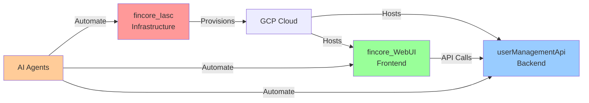

# 🤖 Agentic AI SDLC Automation - Complete Guide

Welcome to your comprehensive guide for implementing **full agentic AI-powered SDLC automation** across your three repositories!

---

## 📖 What's This About?

This project implements **end-to-end automation of your software development lifecycle** using AI agents that handle everything from story creation to production deployment.

### The Vision
**Transform**: Manual, time-consuming processes  
**Into**: Automated, AI-powered workflows  
**Result**: 60% faster delivery with better quality  

---

## 🎯 Quick Start

### 🚀 Want to Get Started RIGHT NOW?

**Read this first**: [EXECUTIVE_SUMMARY.md](./EXECUTIVE_SUMMARY.md) (5 minutes)  
**Then start here**: [QUICK_START_DAY1.md](./QUICK_START_DAY1.md) (2 hours)

### 📚 Want the Full Details?

**Complete Plan**: [AGENTIC_AI_SDLC_PLAN.md](./AGENTIC_AI_SDLC_PLAN.md) (30 minutes)  
**Implementation Checklist**: [AGENTIC_AI_IMPLEMENTATION_CHECKLIST.md](./AGENTIC_AI_IMPLEMENTATION_CHECKLIST.md) (reference)  
**Multi-Repo Strategy**: [MULTI_REPO_COORDINATION.md](./MULTI_REPO_COORDINATION.md) (15 minutes)

---

## 📂 Document Guide

### For Executives & Decision Makers

📊 **[EXECUTIVE_SUMMARY.md](./EXECUTIVE_SUMMARY.md)**
- Business case and ROI
- Risk assessment
- Timeline and costs
- Success metrics
- **Read time**: 5 minutes

### For Project Managers

📋 **[AGENTIC_AI_IMPLEMENTATION_CHECKLIST.md](./AGENTIC_AI_IMPLEMENTATION_CHECKLIST.md)**
- Week-by-week checklist
- Success criteria
- Risk mitigation
- Status tracking
- **Use case**: Project planning and tracking

### For Developers & Technical Leads

📖 **[AGENTIC_AI_SDLC_PLAN.md](./AGENTIC_AI_SDLC_PLAN.md)**
- Complete technical architecture
- AI agent design and implementation
- Workflow specifications
- Technology stack details
- **Read time**: 30 minutes

🚀 **[QUICK_START_DAY1.md](./QUICK_START_DAY1.md)**
- Hands-on implementation guide
- Step-by-step instructions
- Get first AI agent running today
- **Time to implement**: 2 hours

🔄 **[MULTI_REPO_COORDINATION.md](./MULTI_REPO_COORDINATION.md)**
- How 3 repositories work together
- Deployment ordering
- Dependency management
- Cross-repo workflows
- **Read time**: 15 minutes

---

## 🎬 Implementation Path

### Option 1: Quick Start (Recommended for Getting Started)
```
1. Read EXECUTIVE_SUMMARY.md (understand what we're building)
   ↓
2. Follow QUICK_START_DAY1.md (get first agent working)
   ↓
3. Test with sample issues (see AI in action)
   ↓
4. Read full plan when ready to scale
```

### Option 2: Comprehensive (Recommended for Planning)
```
1. Read EXECUTIVE_SUMMARY.md (business case)
   ↓
2. Review AGENTIC_AI_SDLC_PLAN.md (full details)
   ↓
3. Study AGENTIC_AI_IMPLEMENTATION_CHECKLIST.md (plan execution)
   ↓
4. Use QUICK_START_DAY1.md to begin implementation
```

### Option 3: Technical Deep Dive
```
1. Start with AGENTIC_AI_SDLC_PLAN.md (architecture)
   ↓
2. Review MULTI_REPO_COORDINATION.md (integration)
   ↓
3. Use QUICK_START_DAY1.md (implementation)
   ↓
4. Follow AGENTIC_AI_IMPLEMENTATION_CHECKLIST.md (execution)
```

---

## 🏗️ System Overview

### Three Repositories



### Six AI Agents

1. **🤖 Story Analyzer** - Parses stories, estimates complexity
2. **🏛️ Architect** - Designs solutions, creates diagrams
3. **👨‍💻 Developer** - Writes code and tests
4. **🧪 Test Orchestrator** - Runs all test suites
5. **👀 Code Reviewer** - Reviews and approves code
6. **📚 Documentation** - Keeps docs up-to-date

### The Flow

```
Story → Analyze → Design → Develop → Test → Review → Document → Deploy
  ↑                                                                 ↓
  └─────────────────── Monitor & Learn ──────────────────────────┘
```

---

## 📊 Key Benefits

### 🚀 Velocity
- **60% faster** story completion
- **Daily deployments** (instead of weekly)
- **2 days** lead time (down from 7)

### ✅ Quality
- **80%+ test coverage** (consistent)
- **50% fewer bugs** (caught earlier)
- **100% documentation** (always current)

### 💰 ROI
- **$13,700/month** net savings
- **860% ROI** monthly
- **3-day payback** period

### 👥 Developer Experience
- **70% less** repetitive work
- **2x productivity** improvement
- Focus on **creative** problem-solving

---

## 🗓️ Timeline

| Phase | Duration | Key Deliverables |
|-------|----------|------------------|
| **Phase 1**: Foundation | Weeks 1-2 | First AI agent working |
| **Phase 2**: Core Agents | Weeks 3-6 | All agents implemented |
| **Phase 3**: Advanced | Weeks 7-10 | Multi-repo coordination |
| **Phase 4**: Production | Weeks 11-12 | NPE fully automated |

**Total**: 12 weeks to full automation

---

## 💡 Quick Reference

### 🎯 I want to...

#### Understand the business value
→ Read [EXECUTIVE_SUMMARY.md](./EXECUTIVE_SUMMARY.md)

#### See the complete technical plan
→ Read [AGENTIC_AI_SDLC_PLAN.md](./AGENTIC_AI_SDLC_PLAN.md)

#### Start implementing today
→ Follow [QUICK_START_DAY1.md](./QUICK_START_DAY1.md)

#### Track implementation progress
→ Use [AGENTIC_AI_IMPLEMENTATION_CHECKLIST.md](./AGENTIC_AI_IMPLEMENTATION_CHECKLIST.md)

#### Understand multi-repo coordination
→ Read [MULTI_REPO_COORDINATION.md](./MULTI_REPO_COORDINATION.md)

#### Get budget approval
→ Share [EXECUTIVE_SUMMARY.md](./EXECUTIVE_SUMMARY.md) with stakeholders

#### Train my team
→ Start with [EXECUTIVE_SUMMARY.md](./EXECUTIVE_SUMMARY.md), then [QUICK_START_DAY1.md](./QUICK_START_DAY1.md)

---

## 📈 Success Metrics

Track these KPIs to measure success:

- ✅ **Deployment frequency**: Target 10x increase
- ✅ **Lead time**: Target 70% reduction
- ✅ **Test coverage**: Target >80%
- ✅ **PR auto-approval rate**: Target >60%
- ✅ **Developer productivity**: Target +40%

---

## 💰 Investment & ROI

### Monthly Investment
- **GitHub Copilot**: $200-400
- **GCP Infrastructure**: $300-600
- **Total**: $500-1,000

### Monthly Return
- **Time Saved**: 196 hours
- **Value**: $14,700
- **Net Benefit**: $13,700
- **ROI**: 860%

**Payback Period**: 3 days 🎉

---

## ⚠️ Important Notes

### Human Oversight Required For:
- ✋ Production deployments
- ✋ Database schema changes
- ✋ Breaking API changes
- ✋ Security-critical changes
- ✋ Architecture decisions

### AI Handles Autonomously:
- ✅ Story analysis
- ✅ Architecture design (review only)
- ✅ Code implementation
- ✅ Test generation
- ✅ Code review
- ✅ Documentation updates
- ✅ NPE deployments

---

## 🚀 Ready to Start?

### Today (Next 2 Hours)
1. Read [EXECUTIVE_SUMMARY.md](./EXECUTIVE_SUMMARY.md) (5 min)
2. Get buy-in from team (15 min)
3. Follow [QUICK_START_DAY1.md](./QUICK_START_DAY1.md) (2 hours)
4. See your first AI agent in action! 🎉

### This Week
- Complete Phase 1 setup (all 3 repos)
- Test with 2-3 stories
- Train team on new workflows

### This Month
- Implement core AI agents
- Automate NPE deployment
- Measure and optimize

### This Quarter
- Production-ready automation
- Full multi-repo coordination
- 60% faster delivery

---

## 📞 Questions?

### Technical Questions
- Review [AGENTIC_AI_SDLC_PLAN.md](./AGENTIC_AI_SDLC_PLAN.md)
- Check GitHub Actions logs
- Consult GitHub Copilot documentation

### Implementation Questions
- Review [AGENTIC_AI_IMPLEMENTATION_CHECKLIST.md](./AGENTIC_AI_IMPLEMENTATION_CHECKLIST.md)
- Follow [QUICK_START_DAY1.md](./QUICK_START_DAY1.md)
- Check [MULTI_REPO_COORDINATION.md](./MULTI_REPO_COORDINATION.md)

### Business Questions
- Review [EXECUTIVE_SUMMARY.md](./EXECUTIVE_SUMMARY.md)
- Check ROI calculations
- Review risk mitigation strategies

---

## 🎯 Project Information

### Repositories
- **Frontend**: [fincore_WebUI](https://github.com/kasisheraz/fincore_WebUI)
- **Backend**: [userManagementApi](https://github.com/kasisheraz/userManagementApi)
- **Infrastructure**: [fincore_Iasc](https://github.com/kasisheraz/fincore_Iasc)

### Technology Stack
- **AI**: GitHub Copilot, GitHub Actions
- **Frontend**: React, TypeScript, Material-UI
- **Backend**: Node.js (assumed)
- **Infrastructure**: Terraform (assumed)
- **Testing**: Jest, Playwright
- **Deployment**: GCP Cloud Run

### Current State
- ✅ NPE deployment automated (frontend)
- ✅ E2E testing setup (Playwright)
- ✅ Basic CI/CD (GitHub Actions)
- 🟡 Manual story management
- 🟡 Manual code review
- 🟡 Manual documentation

### Future State (12 weeks)
- ✅ Full SDLC automation
- ✅ 6 AI agents operational
- ✅ Multi-repo coordination
- ✅ 60% faster delivery
- ✅ Consistent 80%+ test coverage
- ✅ Always up-to-date documentation

---

## 🎉 The Bottom Line

**This isn't just automation—it's transformation.**

We're not replacing developers. We're **amplifying their capabilities** by letting AI handle the repetitive work while humans focus on creative problem-solving and strategic decisions.

**The result?**
- Happier developers 😊
- Faster delivery 🚀
- Better quality ✨
- Lower costs 💰
- More innovation 💡

**Ready to begin?**

👉 **Start here**: [QUICK_START_DAY1.md](./QUICK_START_DAY1.md)

---

## 📚 Document Index

| Document | Purpose | Audience | Time |
|----------|---------|----------|------|
| **[README_AGENTIC_AI.md](./README_AGENTIC_AI.md)** | This file - Navigation hub | Everyone | 5 min |
| **[EXECUTIVE_SUMMARY.md](./EXECUTIVE_SUMMARY.md)** | Business case, ROI, decisions | Executives, Managers | 5 min |
| **[AGENTIC_AI_SDLC_PLAN.md](./AGENTIC_AI_SDLC_PLAN.md)** | Complete technical plan | Tech Leads, Architects | 30 min |
| **[QUICK_START_DAY1.md](./QUICK_START_DAY1.md)** | Get started in 2 hours | Developers, DevOps | 2 hours |
| **[AGENTIC_AI_IMPLEMENTATION_CHECKLIST.md](./AGENTIC_AI_IMPLEMENTATION_CHECKLIST.md)** | Week-by-week checklist | Project Managers, Team | Reference |
| **[MULTI_REPO_COORDINATION.md](./MULTI_REPO_COORDINATION.md)** | Multi-repo strategy | Developers, Tech Leads | 15 min |

---

**Let's build the future of software development together!** 🚀

*Created: March 16, 2026*  
*Last Updated: March 16, 2026*  
*Version: 1.0*
